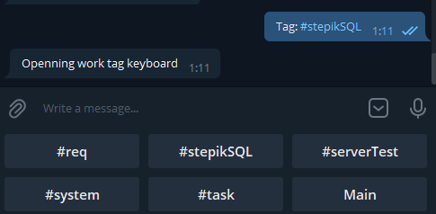
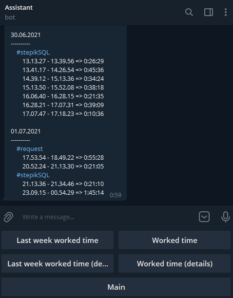
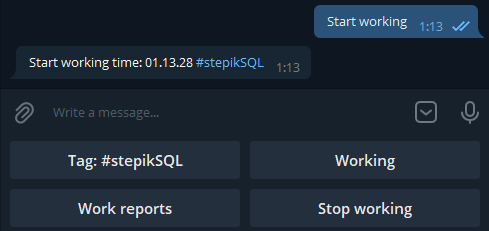
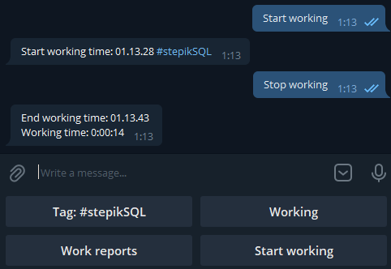
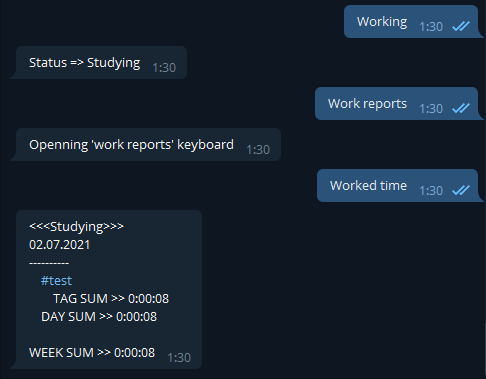
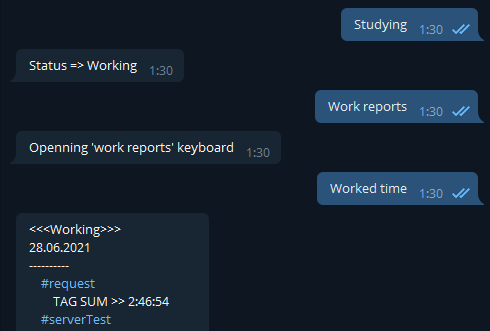

# ReportBot

With this bot you can track your worked hours. 

Using different tags you can split time intervals. (Also you can create your own tags writing #tag_name).

 

In "Work reports you can find different output ways to get data about worked intervals.

 

After clicking "Start working" your work timer is starting. Instead of "Start working" appears "Stop Working".

 

After clicking "Stop working" your work timer stops and saves.

 

By clicking "Studing" or "Working" you can change mode. Data in each mode is stored independently of each other.

 
