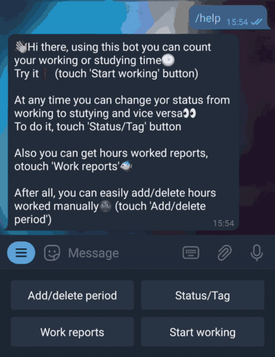
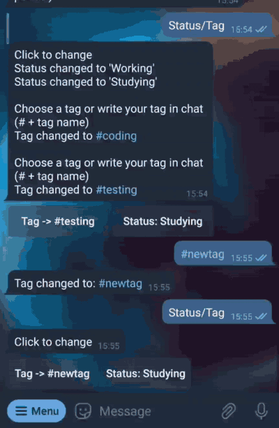
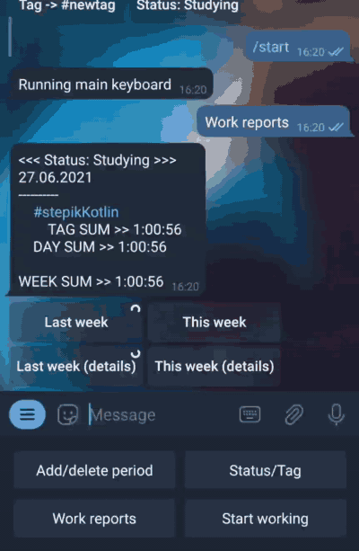
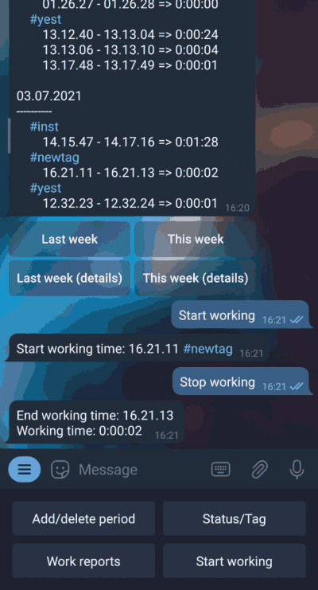

  

Contact me:  

Versions:  

Language:  

# ReportBot

## With this bot you can track your worked hours. 

1. ["Status/Tag" button](#status_tag)
2. ["Work reports" button](#work_reports)
3. ["Start working" and "Stop working" buttons](#start_stop_working)
4. ["Add/delete period" button](#add_delete_period)
    1. ["Delete" inline button](#delete)
    2. ["Add" inline button](#add)

 
## "Status/Tag" button

All work periods can be divided into '***Working***' and '***Studying***' _statuses_,
at the same time, each work period has its own _tag_

You can choose previously used tags or create your own by _writing # and tag name to the bot_ ( _#testing_ )

<!--  -->

[Back to table of contents](#table_of_contents)

 
## "Work reports" button

At any convenient moment, you can get a _report_ on the hours worked for the _current_ or _last_ week

There are two types of reports, with _details_ - here you will see each worked period 
and _standard_ - here all worked periods are summarized by tags, days and weeks

[Back to table of contents](#table_of_contents)

 
## "Start working" and "Stop working" buttons

You can run working timer by clicking '***Start working***' button, after that
you will get a message mith start working time, and instead of the '***Start working***', the '***Stop working***' will appear

[Back to table of contents](#table_of_contents)

 
## "Add/delete period" button

After clicking '***Add/delete period***' you will get message with inline buttons from the bot

[Back to table of contents](#table_of_contents)

 
### "Delete" inline button

Using it you can delete any work period. After the bot will send you a list of numbered periods,
to delete, select the desired number under the message

[Back to table of contents](#table_of_contents)

 
### "Add" inline button

Using it you can add any work period of the current month, up to the current time. 
After the bot will send you a date constructor with instructions

[Back to table of contents](#table_of_contents)
